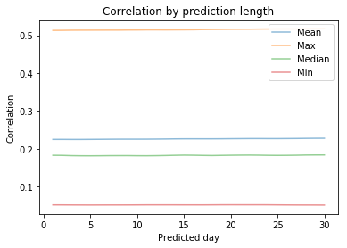
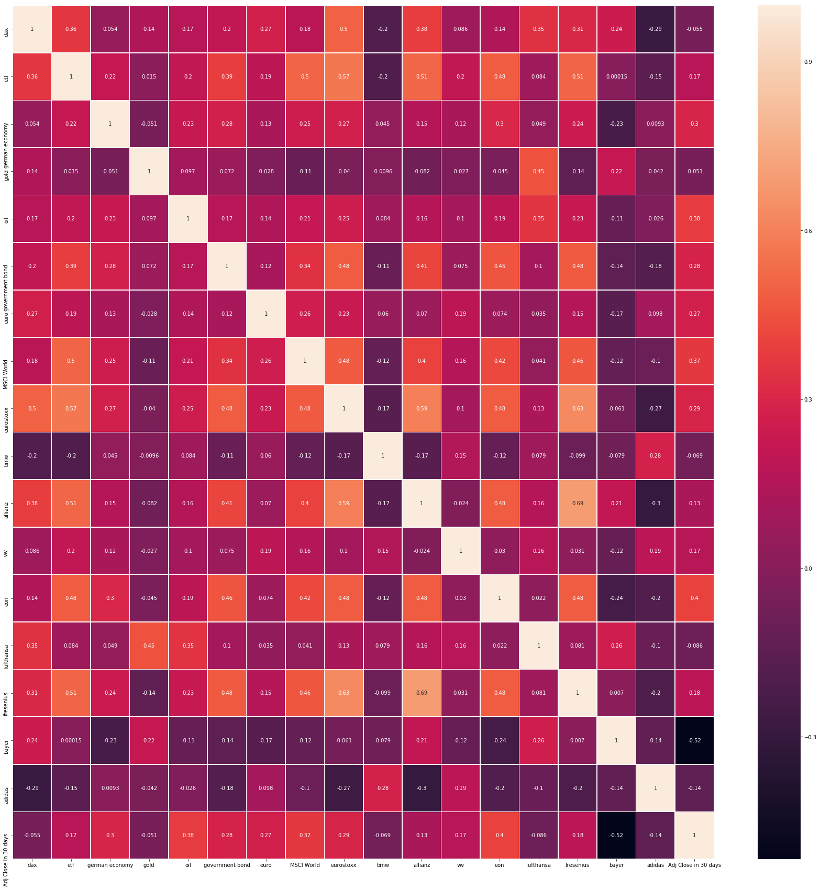

  

<h2 align="center">Are predicitions based on Google Trends data better than gambling?</h2>

  A brief introductory analysis if Google Trends data can be used to have a look in the future - by trying to predict the share price of the german stock index DAX. 
   
  <a href="https://github.com/jo-ai-chim/Project_Google_Trends_Prediction"><strong>Explore the code »</strong></a>

**Spoiler alert: Yes they are!**

After I discovered Google Trends I directly wondered myself if the data can be used for more than just some party games. So I set up a small project trying to get an answer to this question. After reading this article I hope you agree that there is a big potential in using the google trends data and that you can't stop of thinking about potential use cases.

For my analysis I picked the share price of the german stock index DAX. Since "money makes the world go round" I thought this might nbe a good pick. Moreover the data can be easily accessed via [yahoo-finance](https://de.finance.yahoo.com/).

Before making a prediction I tried to answer the question

**How far in the future it might even be possible to make predictions for?**

To get an answer I checked the correlation between the search terms I picked for making the prediction and the share price of the DAX in the next 30 days.

  

As you can see from the graph above the result was quite stunning. (At least for my example) the correlation doesn't seem to depend on how far you want to look into the future. So to continue I chose trying to predict the share price in 30 days.

  

Since the correlation for some search terms I piced were quite big (as you can see from the picture above) I was quite optimistic when I tried to answer the second question

**Is it possible to make a good prediction?**

